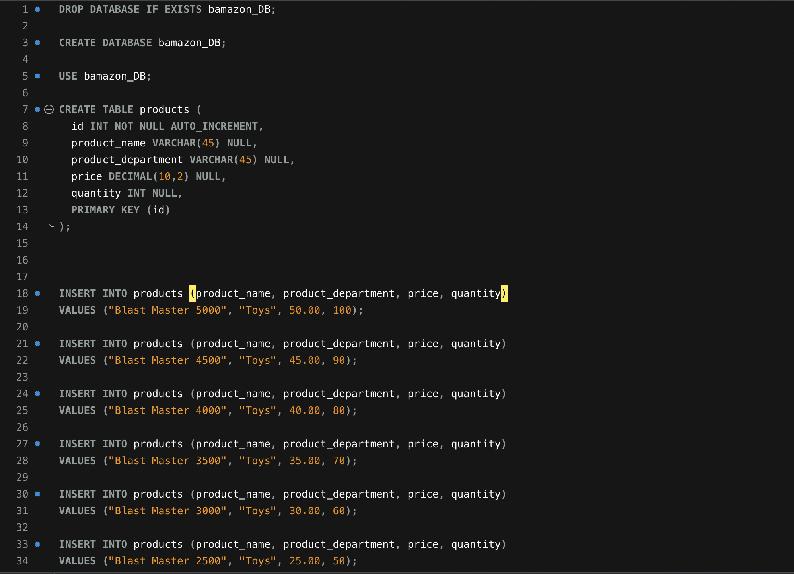
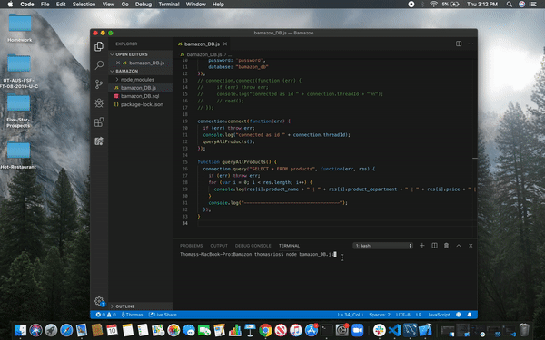
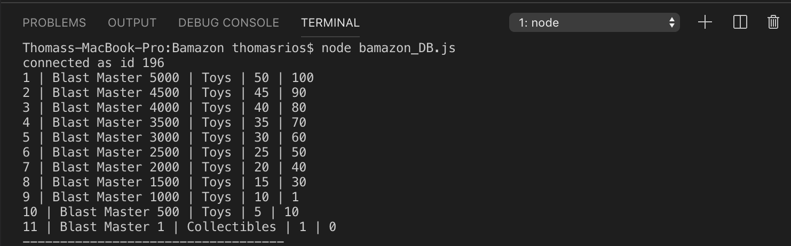
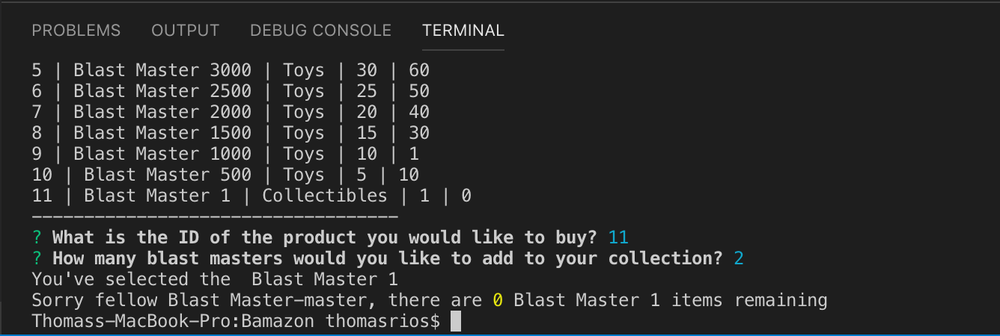
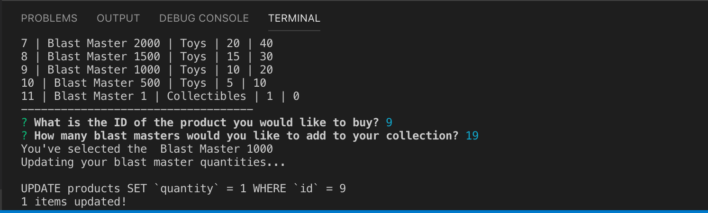
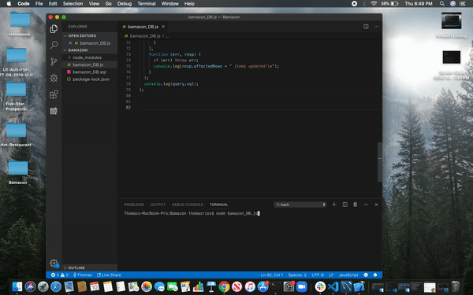

# Thomas Rios - Bamazon App 

## Bamazon Overview

This is an Amazon-like storefront for the hottest new Nerf toy called the "BLAST MASTER". This app was created with MySQL, node package manager and javascript. The app will take in orders from customers and deplete stock from the Blast Master inventory. This app uses MySQL and Inquirer npm packages for data input and storage.

### Steps taken

1. Created a MySQL Database called `bamazon`.

2. Created a Table inside of that database called `products`.

3. Added each of the following columns:

   * item_id (unique id for each product)

   * product_name (Name of specific 'Blast Master' product)

   * department_name

   * price (cost to customer)

   * stock_quantity (how much of the product is available in stores)
   
   4. Populated the database 10 different Blast Master products. 

5. Created a Node application called `bamazon_DB.js`. Running this application will first display all of the Blast Master items available for sale. This includes the ids, names, and prices of Blast Master products for sale.

6. The app then prompts users with two messages.

   * The first should asks them the ID of the Blast Master product they would like to buy.
   
   * The second message asks how many units of the product they would like to buy.

7. Once the customer has placed the order, the application checks if the store has enough of the product to meet their request.

   * If not, the app displays the message "Sorry fellow Blast Master, there are 0 (selected product) remaining" and then prevent the order from going through.
   

 

8. However, if the store does have enough of the product, it fulfills the customer's order. This updates the SQL database to reflect the remaining quantity.

  

Full Demo 

